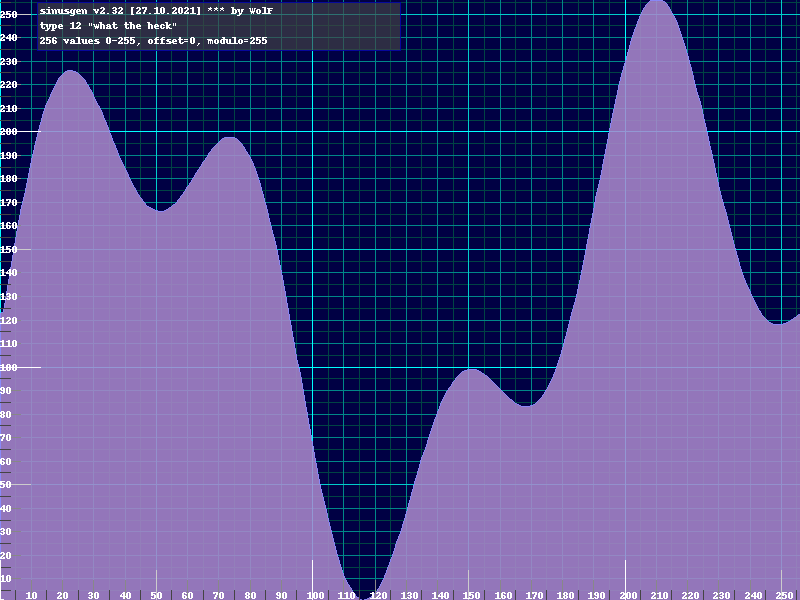

# SinusGen

SinusGen generates and writes sinus data as bytes into a binary file. If values are greater than 256, two files are written.
As of now, this is a commandline-tool. This might change in the future.
It runs on 64 bit versions of Linux, MacOS, Windows and other systems supported by Python. 



# Why SinusGen?

reason | description
---|---
open source | easy to modify and to improve, any useful contribution is highly welcome
portable | available on Linux, MacOS, Windows and any other system supported by Python3
easy to use | simple .json config file or commandline parameters
eyecandy | optional graphical preview of the data


# Usage

    sinusgen v2.32 [27.10.2021] *** by fieserWolF
    usage: sinusgen.py [-h] [-cfg CONFIG_FILE] [-show] [-list] [-output OUTPUT_FILE] [-min MINIMUM_VALUE] [-max MAXIMUM_VALUE] [-steps STEPS]
                        [-type TYPE] [-invert] [-offset OFFSET] [-mod MODULO]

    This program writes sinus data as bytes into a binary file. If values are greater than 256, two files are written.

    optional arguments:
      -h, --help           show this help message and exit
      -cfg CONFIG_FILE     configuration in .json format
      -show                show preview
      -list                list all avaiable sinus types and exit
      -output OUTPUT_FILE  name of binary output file without its suffix
      -min MINIMUM_VALUE   minimum value (0-65535)
      -max MAXIMUM_VALUE   maximum value (0-65535)
      -steps STEPS         amount of bytes to generate, values below 5 cause an error with some sinus-types
      -type TYPE           sinus type, see output of --list
      -invert              invert values
      -offset OFFSET       step offset, where to begin
      -mod MODULO          modulo value

    Note: All values of a config-file can be overwritten by commandline parameters.

    Examples:
        ./sinusgen.py -cfg sinus1.json -show
        ./sinusgen.py -output datafile -min 0 -max 255 -steps 256 -type 1 -invert -offset 20 -mod 8
        ./sinusgen.py -cfg sinus1.json -max 255 -type 10 -show


# Available sinus types

     0 : "full sinus"
     1 : "half sinus"
     2 : "shot"
     3 : "boobs"
     4 : "small hill, big hill"
     5 : "high valleys"
     6 : "three hills"
     7 : "three irregulars"
     8 : "four brothers"
     9 : "wave shot"
    10 : "zig zag"
    11 : "double trouble"
    12 : "what the heck"
    13 : "landscape"
    14 : "two hills"
    15 : "whatever"
    16 : "the famous Mr Ed"
    17 : "curly"
    18 : "Oh dear..."
    19 : "When will it end?"
    20 : "ice cream"
    21 : "good grief..."
    22 : "nonsense"
    23 : "windy"
    24 : "one more to go"
    25 : "Thanks God it`s over."


# example.json

    {
        "output": "sinus1",
        "min": 0,
        "max": 255,
        "steps": 256,
        "type" : 12,
        "invert" : 0,
        "offset" : 0,
        "mod" : 0,
        "comment" : "steps-values below 5 cause an error with some sinus-types"
    }


# Author

* fieserWolF/Abyss-Connection - *code* - [https://github.com/fieserWolF](https://github.com/fieserWolF) [https://csdb.dk/scener/?id=3623](https://csdb.dk/scener/?id=3623)


# Getting Started

sinusgen comes in two flavors:

- standalone executable for 64-bit systems Linux, MacOS/Darwin will follow and Windows will follow (see [releases](https://github.com/fieserWolF/sinusgen/releases))
- Python3 script

## Run the standalone executable

Just download your bundle at [releases](https://github.com/fieserWolF/sinusgen/releases) and enjoy.
Keep in mind that only 64bit systems are supported as I could not find a 32bit system to generate the bundle.

### Note for Windows users

If some antivirus scanner puts sinusgen into quarantine because it suspects a trojan or virus, simply put it out there again.
It isn`t harmful, I used PyInstaller to bundle the standalone executable for you.
Unfortunately, the PyInstaller bootloader triggers a false alarm on some systems.
I even tried my best and re-compiled the PyInstaller bootloader so that this should not happen anymore. Keep your fingers crossed ;)

### Note for MacOS users

Your system might complain that the code is not signed by a certificated developer. Well, I am not, so I signed the program on my own. 
```
"sinusgen" can`t be opened because it is from an unidentified developer.
```
You need to right-click or Control-click the app and select “Open”.


## Run the Python3 script directly

Download _sinusgen.py_ and c64labels.json into the same folder on your computer.

    python3 sinusgen.py 


### Prerequisites

At least this is needed to run the script directly:

- python 3
- argparse
- python "The Python Imaging Library" (PIL)

Normally, you would use pip like this:
```
pip3 install argparse pillow
```

On my Debian GNU/Linux machine I use apt-get to install everything needed:
```
apt-get update
apt-get install python3 python3-argh python3-pil
```
# Changelog

## Future plans

- maybe: implement full GUI

Any help and support in any form is highly appreciated.

If you have a feature request, a bug report or if you want to offer help, please, contact me:

[http://csdb.dk/scener/?id=3623](http://csdb.dk/scener/?id=3623)
or
[wolf@abyss-connection.de](wolf@abyss-connection.de)


## Changes in 2.32

- proper commandline support
- bugfixes


## Changes in 2.0

- complete rewrite in python


## Changes in 1.0

- initial release in freepascal

# License

_SinusGen sinus generator._

_Copyright (C) 2021 fieserWolF / Abyss-Connection_

This program is free software: you can redistribute it and/or modify it under the terms of the GNU General Public License as published by the Free Software Foundation, either version 3 of the License, or (at your option) any later version.

This program is distributed in the hope that it will be useful, but WITHOUT ANY WARRANTY;
without even the implied warranty of MERCHANTABILITY or FITNESS FOR A PARTICULAR PURPOSE.
See the GNU General Public License for more details.

You should have received a copy of the GNU General Public License along with this program.
If not, see [http://www.gnu.org/licenses/](http://www.gnu.org/licenses/).

See the [LICENSE](LICENSE) file for details.

For further questions, please contact me at
[http://csdb.dk/scener/?id=3623](http://csdb.dk/scener/?id=3623)
or
[wolf@abyss-connection.de](wolf@abyss-connection.de)

For Python3 and other used source licenses see file [LICENSE_OTHERS](LICENSE_OTHERS).


